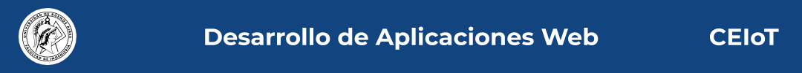

# DAW Project Template

Autor: Fabian S. - 2020

Este Readme está basado en el Template project for Web Applications Development.

```To read all project documentation, please go to its wiki in [this link](https://github.com/ce-iot/daw-project-template/wiki).

# Tabla de contenidos
    * Introducción
    * Correr la aplicación
    * Créditos
    * Contribuir

# **Introduccion**
El proyecto presentado el cual se denonnima "Smart Home" y fue desarrollado empleando los conocimientos adquiridos en la materia Desarrollo Web de Aplicaciones (DAW) :blush:. Consiste de un frontend empleando el framework Materialize y el lenguaje de programación typescript. Del lado de backend se empleó la herramienta Nodejs. 

Respecto al desarrollo, en la página se pueden agregar nuevos dispositivos, modificar su nombre e indicar su estado.

# Correr la aplicación
Posterior al pull del repo, la aplicación se puede ejecutar al correr el siguiente comando en la terminal:
```sh
docker-compose up
```

Para confirmar que la API ha sido levantado de manera correcta, verificar en la terminal la siguiente leyenda:
```javascript
*node-backend    | NodeJS API running correctly
node-backend    | Connected to DB under thread ID: id*
```
## Creditos
Este trabajo final está basado en el template desarrollado por:
 *Agustín Bassi
 *Santiago Germino
 *Brian Ducca 

## Contribuir
Para contribuir realizar un pull request con las sugerencias.

## Licencia
GPL


## Licence

```


